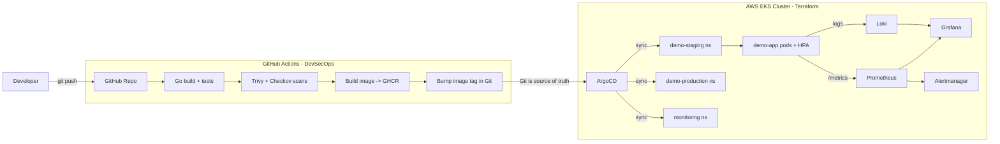

# ☁️ Cloud-Native GitOps Platform with Full Observability

A production-style, end-to-end DevOps/SRE platform on **AWS EKS**, provisioned with
**Terraform**, delivered via **GitOps (ArgoCD)**, secured with a **DevSecOps CI/CD
pipeline**, and monitored with a complete **observability stack** (Prometheus,
Grafana, Loki, Alertmanager).

> Built to demonstrate real-world platform engineering: infrastructure-as-code,
> continuous delivery, zero-downtime rollouts, autoscaling, and SLO-based alerting.

---

## 🏛️ Architecture



**Flow:** push code → CI runs tests + security scans → image built, scanned and
pushed to GHCR → CI bumps the image tag in Git → **ArgoCD** detects the change and
syncs the cluster → Prometheus/Loki observe the app → Grafana visualises the
golden signals → Alertmanager fires on SLO breaches.

---

## 🧰 Tech Stack

| Layer | Tools |
|-------|-------|
| **Infrastructure** | Terraform, AWS (EKS, VPC, IAM, NAT, EC2) |
| **Containers** | Docker (multi-stage, distroless, non-root) |
| **Orchestration** | Kubernetes, Kustomize (base + overlays), HPA, PDB |
| **GitOps / CD** | ArgoCD (app-of-apps pattern) |
| **CI / DevSecOps** | GitHub Actions, Trivy, Checkov |
| **Observability** | Prometheus, Grafana, Loki, Alertmanager, ServiceMonitor |
| **App** | Go (Prometheus metrics, health/readiness probes, graceful shutdown) |

---

## 📁 Repository Layout

```
cloud-native-gitops-platform/
├── app/                     # Go microservice + Dockerfile + tests
├── terraform/               # AWS VPC + EKS infrastructure as code
├── kubernetes/
│   ├── base/                # Deployment, Service, HPA, PDB, ServiceMonitor
│   └── overlays/            # staging + production (Kustomize)
├── argocd/
│   ├── app-of-apps.yaml     # single root app that manages everything
│   └── apps/                # Prometheus stack, Loki, demo app (staging/prod)
├── observability/           # SLO alert rules + Grafana dashboard
├── .github/workflows/       # CI/CD pipeline
└── Makefile                 # one-command bootstrap
```

---

## 🚀 Quick Start

### Prerequisites
`aws-cli` · `terraform >= 1.6` · `kubectl` · `docker` · `go >= 1.23`

### 1. Run the app locally
```bash
make run          # starts on http://localhost:8080
curl localhost:8080/healthz
curl localhost:8080/metrics
```

### 2. Provision the cluster
```bash
make infra-init
make infra-apply        # creates VPC + EKS (takes ~15 min)
make kubeconfig
```

### 3. Bootstrap GitOps
```bash
make bootstrap          # installs ArgoCD + applies the app-of-apps
```
ArgoCD now reconciles the **entire platform** — monitoring stack + app — straight
from this Git repo. Nothing is deployed by hand.

### 4. Explore
```bash
kubectl -n argocd port-forward svc/argocd-server 8080:443      # ArgoCD UI
kubectl -n monitoring port-forward svc/kube-prometheus-stack-grafana 3000:80  # Grafana
```

### 5. Tear down
```bash
make infra-destroy
```

---

## 🔐 Reliability & Security Highlights
- **Zero-downtime rollouts** — `maxUnavailable: 0`, readiness gates, PodDisruptionBudget
- **Autoscaling** — HPA on CPU & memory (2 → 10 replicas)
- **Hardened containers** — distroless, non-root, read-only root FS, all caps dropped
- **Shift-left security** — Trivy (images + filesystem) and Checkov (IaC) gate every PR
- **SLO alerting** — error-rate, p95 latency and availability alerts in Prometheus
- **Least-privilege** — IRSA enabled for pod-level IAM

---

## 📊 Golden Signals Monitored
Latency (p50/p95/p99) · Traffic (req/s) · Errors (5xx ratio) · Saturation (replicas / HPA)

---

## 👤 Author
**Asam Ahamed** — DevOps & Site Reliability Engineer
[GitHub](https://github.com/Asamahamed) · asamahamed487@gmail.com
